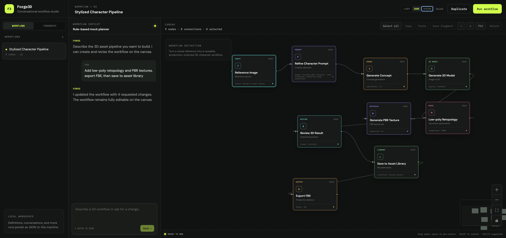

# Forge3D Workflow Studio

A local-first demo for creating reusable 3D production workflows through a normal chat interface. The rule-based mock planner turns requests into a versioned JSON DAG rendered on an editable Vue Flow canvas.

No external LLM or 3D service is called.



## Run

```bash
npm install
npm run dev
```

The Vite app runs on `http://localhost:5173` and proxies `/api` to the Node.js mock API on `http://127.0.0.1:8787`.

## Verify

```bash
npm test
npm run build
```

## Features

- Chat-driven creation and revision of 3D workflows
- Deterministic planner for low-poly and PBR texture requests
- Versioned workflow JSON kept separate from Vue Flow's rendering format
- Editable infinite canvas with free positioning, selection, connections, zoom, and MiniMap
- Workflow loading, autosave, duplication, and mock execution
- Box selection, select all, and copy/paste between workflows
- Reusable Block Library for saving selected steps and inserting them into any workflow
- Share reusable blocks by link, or import and export them as portable JSON
- Conversation, workflow, and run persistence across server restarts
- Responsive desktop and mobile layouts

## Data Model

Workflow nodes contain domain data and a canvas position:

```json
{
  "id": "texture",
  "type": "texture",
  "name": "Generate PBR Texture",
  "config": { "resolution": "2k", "pbr": true },
  "ui": { "position": { "x": 1240, "y": 120 } }
}
```

Edges use semantic ports rather than Vue Flow handle IDs:

```json
{
  "id": "model-texture",
  "source": { "nodeId": "model", "port": "model" },
  "target": { "nodeId": "texture", "port": "model" }
}
```

Runtime data is written atomically to `server/data/*.json`. Those files are ignored by Git and initialized from committed examples in `server/seed/`.

Reusable blocks are stored internally as workflow fragments using the versioned `workflow-fragment` format. They contain normalized node positions, internal edges, source provenance, and an explicit input/output interface for connections that crossed the original selection boundary. This allows a saved block to be inserted into any workflow without preserving references to nodes outside the original selection.

## Mock API

- `GET /api/workflows`
- `GET /api/workflows/:id`
- `PUT /api/workflows/:id`
- `POST /api/workflows/:id/duplicate`
- `POST /api/workflows/:id/runs`
- `POST /api/chat`
- `GET /api/fragments`
- `GET /api/fragments/:idOrShareId`
- `POST /api/fragments`
- `DELETE /api/fragments/:id`

`POST /api/chat` always returns a complete workflow definition. A production backend can replace `server/planner.js` without changing the frontend contract.
