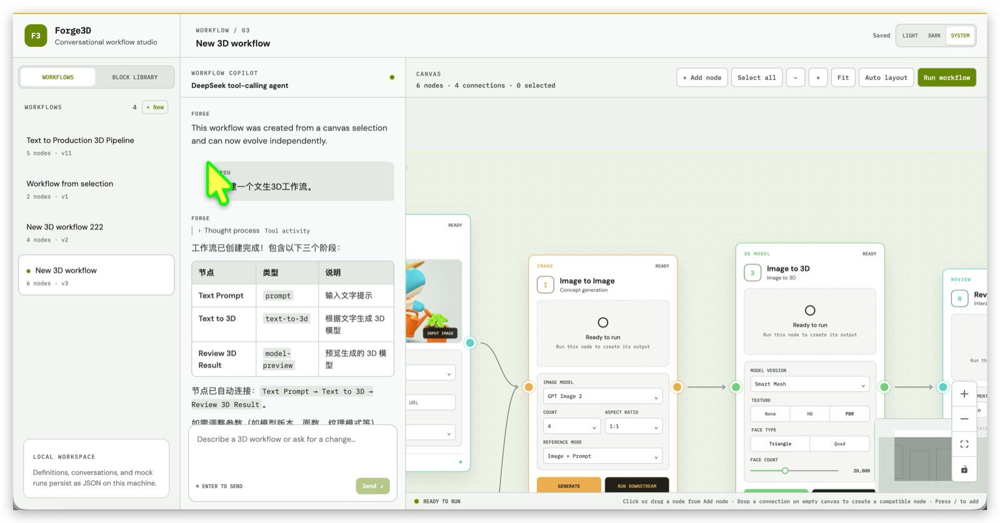

# Forge3D Workflow Studio

[Live Demo](https://forge3d.lumixraku.org/)

A local-first demo for creating reusable 3D production workflows through a normal chat interface. DeepSeek turns requests into a versioned JSON DAG rendered on an editable Vue Flow canvas.

Chat requires a DeepSeek API key. Workflow execution remains simulated; no external 3D service is called.



## Run

```bash
npm install
cp .env.example .env
npm run dev
```

Set `DEEPSEEK_API_KEY` in `.env`. `DEEPSEEK_BASE_URL` defaults to `https://api.deepseek.com` and `DEEPSEEK_MODEL` defaults to `deepseek-v4-flash`.

The Vite app runs on `http://localhost:5173` and proxies `/api` to the Node.js API on `http://127.0.0.1:8787`.

## Deploy to Cloudflare

The production API can run as a Cloudflare Worker. Workflow, conversation, run, fragment, and background-task state is stored in D1; no local filesystem storage is used by the Worker.

1. Create a D1 database and put its ID in `wrangler.toml`:

   ```bash
   npx wrangler d1 create forge3d
   ```

2. Apply the schema and empty collection records:

   ```bash
   npm run cf:d1:migrate
   ```

3. Store the DeepSeek secret:

   ```bash
   npx wrangler secret put DEEPSEEK_API_KEY
   ```

4. Build and deploy the Vue app plus Worker:

   ```bash
   npm run cf:deploy
   ```

`wrangler.toml` serves `dist-cloudflare/` through the Workers Assets binding and routes `/api/*` to `worker.js`. The Worker uses `ctx.waitUntil()` for Agent tasks and keeps task status available through the existing polling API.

The current deployment is available at `https://forge3d.lumixraku.org`.

The sample 3D model is intentionally excluded from Worker Assets because Cloudflare's per-asset limit is 25 MiB and the GLB is larger. Upload `public/models/shark-gardener.glb` to R2 and add an R2 binding plus a `/models` route in `worker.js` if production model downloads are required.

## Verify

```bash
npm test
npm run build
```

## Features

- Chat-driven creation and revision of 3D workflows
- DeepSeek agent with validated workflow-building and parameter-update tools
- Versioned workflow JSON kept separate from Vue Flow's rendering format
- Editable infinite canvas with free positioning, selection, connections, zoom, and MiniMap
- Workflow loading, autosave, duplication, and mock execution
- Box selection, select all, and copy/paste between workflows
- Reusable Block Library for saving selected steps and inserting them into any workflow
- Share reusable blocks by link, or import and export them as portable JSON
- Conversation, workflow, and run persistence across server restarts
- Responsive desktop and mobile layouts

## Agent Tools

The DeepSeek agent can call the following validated function tools to inspect and update the workflow. All five tools are defined and dispatched in `server/deepseek.js`, then sent to DeepSeek in the `tools` field of the chat-completions request. The Node.js server and Cloudflare Worker use this same implementation.

The UI streams a safe activity summary while a request is running, then keeps it collapsed below the final answer. It does not expose the model's private reasoning, raw tool arguments, or tool results.

| Tool call | Purpose |
| --- | --- |
| `get_workflow_structure` | View current nodes, connections, and all available stage types. |
| `build_workflow` | Create or rebuild a workflow from a complete ordered stage list. The server creates the frame, places stages, and connects compatible ports. |
| `get_workflow_parameters` | View adjustable parameters, permitted ranges, and options for current workflow nodes. |
| `update_node_parameters` | Update validated parameters on one existing node using the exact node ID returned by the structure lookup. |
| `add_workflow_stage` | Add any supported workflow node type, including a separate Frame, if that type is not already present. |

### `get_workflow_structure`

**Description**

> Inspect the current workflow nodes and connections, plus every stage type that can be created.

**Parameters**

No parameters. Extra properties are rejected.

**Returns**

- `nodes`: the current nodes with `id`, `type`, and `name`
- `edges`: the current workflow connections
- `availableStageTypes`: stage types accepted by the workflow planner

Use this tool when the current node IDs, connections, or available stage types are unclear. In particular, use it before updating a node so the exact `nodeId` is known.

### `build_workflow`

**Description**

> Build or rebuild the current workflow from an ordered list of stages. All stages are placed inside one frame and compatible stages are connected automatically.

**Parameters**

```json
{
  "stages": ["reference-image", "prompt", "generate-image"]
}
```

- `stages`: required non-empty array of valid stage type strings
- The array is the complete ordered stage list
- Do not include `frame`; the server creates it automatically

**Returns**

- `frameId`: the generated frame ID
- `nodes`: the created non-frame nodes with `id`, `type`, and `name`
- `edges`: the generated connections

Use this tool to create, rebuild, or redesign a complete workflow. Compatible ports are connected and the resulting nodes are placed automatically.

### `get_workflow_parameters`

**Description**

> List current workflow nodes and their adjustable parameters, valid ranges, and options.

**Parameters**

No parameters. Extra properties are rejected.

**Returns**

- `nodes`: the current nodes with `id`, `type`, and `name`
- `parameters`: parameter definitions for those nodes, including types, ranges, step sizes, and enum options

Use this tool when parameter names, node IDs, valid ranges, or available options are unclear. It describes the current workflow rather than every possible node type.

### `update_node_parameters`

**Description**

> Update validated parameters on one existing workflow node. You must use the exact nodeId returned by get_workflow_structure; do not use a display name or node type.

**Parameters**

```json
{
  "nodeId": "generate-model",
  "parameters": {
    "faceCount": 10000,
    "textureMode": "PBR"
  }
}
```

- `nodeId`: required exact ID of an existing workflow node
- `parameters`: required object containing the explicitly requested canonical property names
- Extra parameter properties are rejected
- Numeric values are checked against their minimum, maximum, and step size
- Enum, string, and boolean values are type-checked

The server returns the changed fields with their previous and new values. Group all requested changes for one node into one call; use separate calls for different nodes.

### `add_workflow_stage`

**Description**

> Add one workflow node of the requested type when that node type does not already exist. Frame can also be added as a separate workflow container.

**Parameters**

```json
{
  "type": "retopology"
}
```

- `type`: required enum containing `frame` and all supported workflow node types

For normal workflow nodes, the planner inserts the node before `model-preview` and rebuilds compatible connections. For `frame`, the planner creates a separate frame with a unique ID; frames are layout containers and do not participate in DAG edges. If the requested non-frame node type already exists, the call is a no-op. The tool returns `addedNodeIds` for nodes added by the operation.

### Tool-call lifecycle

Agent requests are asynchronous:

```text
POST /api/chat
  -> 202 Accepted with a task ID
  -> background agent task
  -> DeepSeek tool calls (up to 5 rounds by default)
  -> GET /api/tasks/:id
  -> succeeded or failed
```

For each round, the agent sends the current conversation and all five tool schemas to DeepSeek. If the assistant returns tool calls, the server parses their JSON arguments, dispatches by function name, appends each tool result, and asks DeepSeek for the next step. The loop ends when the assistant returns a normal response without tool calls. Unsupported tool names, invalid JSON arguments, and invalid parameter values fail the task instead of being silently ignored.

### Available stage types

These are the workflow stages currently represented in the UI and planner:

| Type | Label | Purpose |
| --- | --- | --- |
| `reference-image` | Image Upload | Add an image, asset, or URL reference. |
| `prompt` | Text Prompt | Provide text direction for later stages. |
| `generate-image` | Image to Image | Generate concept images from image and/or prompt input. |
| `generate-model` | Image to 3D | Generate a 3D model from image input. |
| `text-to-3d` | Text to 3D | Generate a 3D model from text input. |
| `retopology` | Retopology | Optimize model geometry. |
| `texture` | Texture Model | Generate PBR materials for a model. |
| `model-preview` | Model Preview | Preview the 3D result. |

`build_workflow` receives an ordered list of these stage types. `frame` is a layout container and is created by the server rather than supplied as a stage.

### Node parameter catalog

`get_workflow_parameters` returns the parameters for nodes that are actually present in the current workflow. The available definitions are:

| Node type | Parameters |
| --- | --- |
| `reference-image` | `sourceType`: `Upload` \| `Asset Library` \| `URL`; `reference`: string; `background`: `Keep` \| `Remove` |
| `prompt` | `prompt`: string; `strength`: number, `0-100`, step `1`, unit `%` |
| `generate-image` | `model`: `GPT Image 2` \| `Flux 1.1 Pro` \| `Stable Diffusion 3.5`; `count`: number, `1-4`, step `1`; `aspectRatio`: `1:1` \| `4:3` \| `3:4` \| `16:9`; `referenceMode`: `Image + Prompt` \| `Prompt only` \| `Image variation` |
| `generate-model` | `faceCount`: number, `1000-50000`, step `1000`; `modelVersion`: `Smart Mesh` \| `v2.5` \| `v2.0`; `textureMode`: `None` \| `HD` \| `PBR`; `faceType`: `Triangle` \| `Quad` |
| `text-to-3d` | `faceCount`: number, `1000-50000`, step `1000`; `modelVersion`: `Smart Mesh` \| `v2.5` \| `v2.0`; `textureMode`: `None` \| `HD` \| `PBR`; `faceType`: `Triangle` \| `Quad` |
| `retopology` | `faceLimit`: number, `500-20000`, step `500`; `modelVersion`: `v2.0` \| `v1.0`; `faceType`: `Triangle` \| `Quad`; `bakeTextures`: boolean |
| `texture` | `resolution`: `1K` \| `2K` \| `4K`; `model`: `Texture v2.0` \| `Texture v1.5`; `style`: `Original` \| `Realistic` \| `Stylized`; `pbr`: boolean |
| `model-preview` | `environment`: `Studio` \| `Outdoor` \| `Neutral`; `autoRotate`: boolean; `wireframe`: boolean |

## Workflow Execution API

The Agent tools modify the workflow definition; they do not execute an external 3D service. `POST /api/workflows/:id/runs` is a separate simulated execution endpoint. It can run one node with `scope: "node"` or the selected node and its downstream nodes with `scope: "downstream"`. The mock runner performs a topological traversal, simulates roughly 600 ms per node, and supports `node.config.mockFailure` for testing failure states.

## Data Model

Workflow nodes contain domain data and a canvas position:

```json
{
  "id": "texture",
  "type": "texture",
  "name": "Generate PBR Texture",
  "config": { "resolution": "2k", "pbr": true },
  "ui": { "position": { "x": 1240, "y": 120 } }
}
```

Edges use semantic ports rather than Vue Flow handle IDs:

```json
{
  "id": "model-texture",
  "source": { "nodeId": "model", "port": "model" },
  "target": { "nodeId": "texture", "port": "model" }
}
```

Runtime data is written atomically to `server/data/*.json`. Those files are ignored by Git and initialized from committed examples in `server/seed/`.

Reusable blocks are stored internally as workflow fragments using the versioned `workflow-fragment` format. They contain normalized node positions, internal edges, source provenance, and an explicit input/output interface for connections that crossed the original selection boundary. This allows a saved block to be inserted into any workflow without preserving references to nodes outside the original selection.

## API

- `GET /api/workflows`
- `GET /api/workflows/:id`
- `PUT /api/workflows/:id`
- `POST /api/workflows/:id/duplicate`
- `POST /api/workflows/:id/runs`
- `POST /api/chat`
- `GET /api/fragments`
- `GET /api/fragments/:idOrShareId`
- `POST /api/fragments`
- `DELETE /api/fragments/:id`
- `GET /api/tasks/:id`
- `GET /api/tasks?workflowId=:id&status=queued,running`

`POST /api/chat` always uses DeepSeek and returns a complete workflow definition. If `DEEPSEEK_API_KEY` is missing, it returns `503` rather than a generated mock response.

`POST /api/workflows/:id/runs` remains a simulated execution endpoint.

The local Node server remains available for development and tests. Cloudflare deployment uses the separate `worker.js` entrypoint and D1 instead of `server/data/*.json`.
